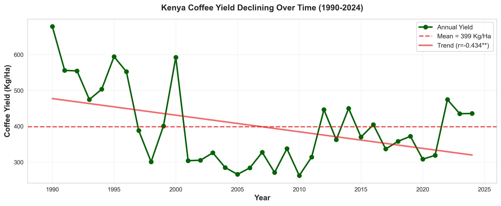
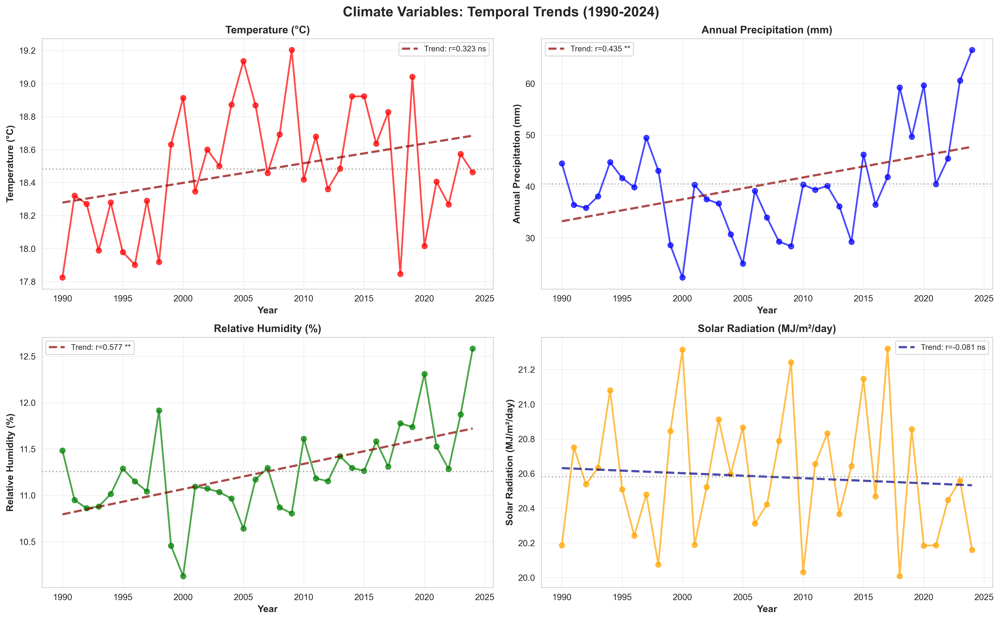

# Climate Drivers of Kenyan Coffee Yield

**A data science investigation using 35 years of climate and agricultural data.**

[]()
[]()
[]()

> How much does climate  explain Kenya's 23% decline in coffee yield since 1990? I built an
> end-to-end pipeline from raw FAO and NASA satellite data to a validated regression
> model to find out. **Short answer: It explains about half.**

**→ [Notebooks](./notebooks) · [Figures](./reports)**

---

## Project Overview

Built an end-to-end data science pipeline analyzing 35 years of Kenyan coffee production
and NASA climate data to quantify how much climate explains declining coffee yields.

✅ 35 years of merged climate + agricultural data (1990–2024)
✅ 8 coffee-growing regions, ~95% of national production
✅ Production-weighted regional climate aggregation
✅ 5-model regression progression with full diagnostic testing
✅ Leave-one-out and lag-sensitivity robustness checks
✅ Fully reproducible notebooks, start to finish

---

## Key Findings

| Finding | Result |
|---|---|
| Yield decline (1990–2024) | **↓ 23%** |
| Strongest climate predictor | **Temperature** (hotter years → lower yield) |
| Rainfall's effect on yield | **Not statistically significant** — in any model tested |
| Best model performance | **51% of yield variance explained** |
| Biggest surprise | **Yield persistence**, not the expected biennial boom-bust cycle |

---

## Why This Project

Growing up in Kenya with family ties to smallholder coffee farming, I wanted to
understand whether climate change alone explains the country's long-term decline in
coffee productivity — rather than relying on anecdotes. I built a reproducible data
pipeline combining agricultural records with satellite-derived climate observations
spanning 35 years to find out.

---

## Data Pipeline

```
FAOSTAT (yield, production, export value)
        │
        ▼
   Data Cleaning
        │
        ▼
NASA POWER Climate Data (8 regions, monthly)
        │
        ▼
Production-Weighted Regional Aggregation
        │
        ▼
       Merged Dataset (35 years)
        │
        ▼
Exploratory Data Analysis
        │
        ▼
   Regression Modeling (OLS → Lagged → AR)
        │
        ▼
   Assumption Diagnostics
        │
        ▼
   Robustness Checks
```

---

## Repository Structure

```
├── notebooks/        data processing + full regression analysis
├── reports/           generated charts and diagnostic plots
├── data/              raw and processed datasets
├── WRITEUP.md         full findings, written for a general audience
└── README.md          you are here
```

---

## Methods

- Data cleaning & merging (FAOSTAT + NASA POWER, 3 separate sources)
- Production-weighted feature engineering across 8 regions
- Exploratory data analysis & correlation testing
- OLS regression, progressively refined across 5 specifications
- Lagged and autoregressive modeling
- Full 5-assumption OLS diagnostic testing (linearity, multicollinearity, normality,
  homoscedasticity, autocorrelation)
- Leave-one-out and multi-lag robustness checks

---

## Results

**Yield fell while rainfall and humidity rose** — the opposite of the "hotter and drier"
narrative usually assumed:




**Model progression** — each version built to fix a specific weakness in the last:

| Model | Specification | R² |
|---|---|---|
| 1 | Temperature only | 0.165 |
| 2 | Full climate model | 0.376 |
| 3 | Climate + year, HAC-corrected | 0.402 |
| 4 | First-differences | 0.029 |
| **5** | **Climate + 1-year lagged yield (final)** | **0.513** |

Model 5 passed all five OLS diagnostic tests and held up under leave-one-out and
lag-sensitivity robustness checks.

---

## What Surprised Me

Coffee is often described as following a **biennial bearing** cycle — a heavy harvest
year depletes the tree, producing a lighter one the next year. If that were driving
Kenya's numbers, last year's yield should *negatively* predict this year's.

Instead, last year's yield **positively** and significantly predicted this year's yield
(p = 0.001), even after controlling for climate. Instead of the expected biennial bearing
pattern, previous-year yield consistently predicted future yield positively. This
suggests persistent farm-level conditions — not only annual climate variation — may
influence productivity.

---

## Limitations

- Small sample size (n = 34–35 annual observations) limits statistical power
- National-level annual aggregation may obscure regional and within-season variation
- No economic, market, disease, or farm-management data included — despite evidence
  (via the persistence finding) that such factors likely matter
- Lagged-dependent-variable models can introduce small-sample coefficient bias
- Correlational design — results establish association, not causation

---

## Future Work

- Flowering-season-specific climate variables (monthly data already collected, not yet
  exploited)
- Coffee price and market-liberalization data (Phase 2, in progress)
- Disease pressure and farm-management proxies
- Region-level panel modeling with fixed effects

---

## Data Sources

- Coffee yield, production, and export value: [FAOSTAT](https://www.fao.org/faostat/)
- Climate data (temperature, precipitation, humidity, solar radiation):
  [NASA POWER](https://power.larc.nasa.gov/), 8 regions covering ~95% of national
  production

---

*Questions or feedback? Open an issue — I'd love to hear them.*